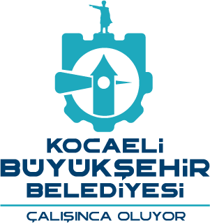

<div align="center">

# SafePoint KBB

**Kocaeli Afet Konum Uygulaması**

Kocaeli'deki acil toplanma alanlarını ve güncel deprem verilerini harita üzerinde bir arada sunan web uygulaması.

[](https://nodejs.org/)
[](https://expressjs.com/)
[](https://leafletjs.com/)
[](LICENSE)
[](#-testler)

[Özellikler](#-özellikler) ·
[Kurulum](#-kurulum) ·
[Çalıştırma](#-çalıştırma) ·
[Ekran Görüntüleri](#-ekran-görüntüleri) ·
[Klasör Yapısı](#-klasör-yapısı) ·
[Geliştirme Önerileri](#-geliştirme-önerileri)

</div>

---

## Proje Adı

**SafePoint KBB** — Kocaeli Büyükşehir Belediyesi Afet Konum Uygulaması

## Mesleki Uygulama (Staj) Bilgisi

| Alan | Bilgi |
|------|-------|
| **Öğrenci** | Zeynep Zehra Kocatürk (230501017) |
| **Bölüm** | Bilgisayar Mühendisliği — 2. Sınıf |
| **Üniversite** | Kocaeli Sağlık ve Teknoloji Üniversitesi, Mühendislik ve Doğa Bilimleri Fakültesi |
| **Kurum** | Kocaeli Büyükşehir Belediyesi — Yazılım Geliştirme Şube Müdürlüğü |
| **Staj süresi** | 01.07.2025 – 05.08.2025 (25 iş günü) |
| **Staj sorumlusu** | Eşref Manav — Bilgisayar Mühendisi |

> Staj sürecinde önce web servisleri (API) araştırması yapıldı; ardından afet toplanma alanları ve deprem verilerini birleştiren bu uygulama geliştirildi. Proje, staj defterinde anlatılan çekirdek işlevlerin (Leaflet harita, Haversine mesafe, Express API, Kandilli deprem entegrasyonu) üzerine, kamu hizmeti kalitesini artırmak için **NVI CSBM tabanlı tam adres seçimi** ve **gerçek sokak koordinatları** eklendi.

## Proje Açıklaması

SafePoint KBB, Kocaeli Büyükşehir Belediyesi Yazılım Geliştirme Şube Müdürlüğü'nde geliştirilen bir mesleki uygulama (staj) projesidir. Uygulama; AFAD toplanma alanı verileri, **NVI CSBM (Cadde/Sokak/Bulvar/Meydan) adres hiyerarşisi**, gerçek sokak koordinatları ve Kandilli deprem kayıtlarını tek ekranda birleştirir.

Kullanıcı Kocaeli'nin 12 ilçesinden birini, mahallesini ve sokak/cadde seçeneğini listeden seçer. Sistem seçilen adrese ait **gerçek koordinatı** (OpenStreetMap + Nominatim) kullanarak en yakın acil toplanma alanlarını hesaplar, deprem verilerini filtreler ve haritada gösterir.

## Projenin Amacı

| Hedef | Açıklama |
|-------|----------|
| **Tam adres seçimi** | NVI CSBM tabanlı 25.363 sokak/cadde — yalnızca AFAD alanları değil |
| **Gerçek koordinat** | OpenStreetMap + Nominatim ile sokak düzeyinde konum doğrulama |
| **Afet farkındalığı** | Kocaeli'deki 496 acil toplanma alanını haritada görünür kılmak |
| **Konum tabanlı yönlendirme** | Seçilen adrese göre en yakın 3 alanı sıralamak |
| **Deprem bilgilendirme** | Kandilli verilerini 500 km yarıçapında filtreleyerek sunmak |
| **Kullanım kolaylığı** | Tarayıcı konum izni gerektirmeden Kocaeli içi manuel seçim |
| **Güvenli mimari** | XSS koruması, güvenlik başlıkları, doğrulanmış geocode proxy |

## Özellikler

- **NVI CSBM konum seçimi** — 12 ilçe, 488 mahalle, **25.363** cadde/sokak/bulvar (İzmit: 3.428 sokak)
- **Gerçek sokak koordinatları** — OSM/Nominatim önbelleği + canlı geocode (`/api/street-location`)
- **İnteraktif harita** — Leaflet.js + OpenStreetMap ile Kocaeli odaklı görünüm
- **Mesafe hesaplama** — Haversine formülü ile coğrafi mesafe
- **Toplanma alanları** — En yakın 3 alan listesi, harita marker'ları ve Google Maps yol tarifi
- **Deprem verileri** — Kandilli API üzerinden canlı deprem bilgisi
- **Otomatik yenileme** — 60 saniyede bir deprem verisi güncelleme
- **Panel-harita etkileşimi** — Deprem satırına tıklayınca haritada odaklanma ve detay modalı
- **Responsive tasarım** — Mobil, tablet ve masaüstü uyumlu arayüz
- **Erişilebilirlik** — ARIA etiketleri, klavye navigasyonu, canlı durum mesajları
- **Güvenlik** — `escapeHtml()` ile XSS koruması, HTTP güvenlik başlıkları, geocode rate limit

## Kullanılan Teknolojiler

### Frontend

| Teknoloji | Kullanım |
|-----------|----------|
| HTML5 | Semantik sayfa yapısı |
| CSS3 | Modüler stil mimarisi (BEM benzeri) |
| JavaScript (ES Modules) | Modüler frontend mimarisi |
| Leaflet.js 1.9.4 | Harita görselleştirme |

### Backend

| Teknoloji | Kullanım |
|-----------|----------|
| Node.js 18+ | Sunucu çalışma ortamı |
| Express.js 4.x | REST API ve statik dosya sunumu |
| CORS | Cross-origin istek yönetimi |

### Dış Servisler

| Servis | Kullanım |
|--------|----------|
| NVI CSBM (adres.nvi.gov.tr türevi) | Kocaeli ilçe/mahalle/sokak hiyerarşisi |
| AFAD Kocaeli | Toplanma alanı verisi |
| OpenStreetMap Overpass | Toplu sokak koordinat eşleştirme |
| Nominatim | Canlı adres → koordinat çözümleme |
| Kandilli Deprem API | Canlı deprem verisi |
| Google Maps | Yürüyüş yol tarifi yönlendirme |

### Geliştirme Araçları

| Araç | Kullanım |
|------|----------|
| Node.js Test Runner | Birim testleri |
| Playwright | E2E testler ve ekran görüntüsü alma |

## Kurulum

### Gereksinimler

- [Node.js](https://nodejs.org/) **18.0.0** veya üzeri
- [npm](https://www.npmjs.com/) (Node.js ile birlikte gelir)
- Modern bir web tarayıcısı (Chrome, Firefox, Edge)

### Adımlar

```bash
# 1. Depoyu klonlayın
git clone https://github.com/zeynepzehrakocaturk/SafePoint-KBB.git
cd SafePoint-KBB

# 2. Bağımlılıkları yükleyin
npm install

# 3. (E2E testler için) Playwright tarayıcısını kurun
npx playwright install chromium

# 4. Testleri çalıştırın
npm test
```

> **Not:** `data/kocaeli-csbm-hierarchy.json` ve `data/kocaeli-street-coordinates.json` dosyaları repoda hazır gelir; `npm start` ile doğrudan çalıştırabilirsiniz. Veriyi yeniden üretmek isterseniz:

```bash
npm run build:csbm
npm run geocode:streets -- --district=İzmit
```

## Çalıştırma

```bash
# Sunucuyu başlatın
npm start
```

Tarayıcıda açın: **http://localhost:3000**

### Kullanım adımları

1. Sol panelden **İlçe**, **Mahalle** ve listeden **Cadde/Sokak** seçin
2. **Konumu Uygula** butonuna tıklayın
3. Sistem gerçek sokak koordinatını yükler ve en yakın 3 toplanma alanını listeler
4. Deprem satırına tıklayarak detay modalını açın
5. **Veriyi Yenile** ile güncel verileri alın

> **Not:** Kocaeli genelinde 25.363 sokak/cadde NVI CSBM listesinden gelir. Koordinatı önbellekte olmayan sokaklar ilk seçimde Nominatim ile canlı çözümlenir ve kaydedilir.

<details>
<summary><strong>Ortam değişkenleri</strong></summary>

| Değişken | Varsayılan | Açıklama |
|----------|-----------|----------|
| `PORT` | `3000` | Sunucu port numarası |
| `APP_URL` | `http://localhost:3000` | Screenshot/E2E test base URL |

```bash
# Örnek: Farklı portta çalıştırma
PORT=8080 npm start
```

</details>

## Ekran Görüntüleri

> Görseller `npm run screenshots` komutu ile alınmıştır.

### Konum Seçimi (NVI CSBM)

İzmit / 28 Haziran mahallesi örneğinde tam sokak listesi — PTT ve NVI adres sistemine uyumlu.

<p align="center">
  
</p>

### Ana Dashboard

Uygulamanın genel görünümü — sol panelde toplanma alanları ve deprem listesi, sağda interaktif harita.

<p align="center">
  
</p>

### Harita Görünümü

Kullanıcı konumu, toplanma alanı ve deprem marker'larının harita üzerindeki gösterimi.

<p align="center">
  
</p>

### Toplanma Alanları Paneli

Konuma göre en yakın 3 acil toplanma alanı ve Google Maps yol tarifi butonları.

<p align="center">
  
</p>

### Deprem Paneli

500 km yarıçapındaki güncel depremlerin tablo halinde listelenmesi.

<p align="center">
  
</p>

### Deprem Detay Modalı

Tablodaki bir depreme tıklandığında açılan detay penceresi ve mini harita.

<p align="center">
  
</p>

### Mobil Görünüm

390×844 viewport ile responsive tasarım testi.

<p align="center">
  
</p>


<details>
<summary><strong>Ekran görüntülerini yeniden alma</strong></summary>

```bash
npm start
# Yeni terminalde:
npm run screenshots
```

</details>

## Klasör Yapısı

```
SafePoint-KBB/
├── server.js                          # Uygulama giriş noktası
├── package.json                       # Proje bağımlılıkları ve scriptler
├── LICENSE                            # MIT lisansı
├── .gitignore
├── .editorconfig
│
├── src/server/                        # Backend kaynak kodları
│   ├── app.js                         # Express uygulama fabrikası
│   ├── config.js                      # Sunucu yapılandırması
│   ├── middleware/
│   │   └── security.js                # HTTP güvenlik başlıkları
│   ├── routes/
│   │   └── api.routes.js              # REST API endpoint'leri
│   └── services/
│       ├── csbmHierarchy.js           # NVI CSBM hiyerarşisi + koordinat önbelleği
│       └── nominatim.js               # Geocode proxy (cache + rate limit)
│
├── public/                            # Frontend statik dosyalar
│   ├── index.html
│   ├── css/
│   │   ├── variables.css
│   │   ├── layout.css
│   │   ├── components.css
│   │   └── main.css
│   └── js/
│       ├── app.js                     # Uygulama orkestrasyonu
│       ├── config/constants.js
│       ├── utils/                     # geo, dom, date, areaCoordinates
│       ├── services/                  # api, earthquakeService
│       ├── ui/                        # assemblyPanel, earthquakePanel
│       └── map/mapController.js
│
├── data/
│   ├── acil-toplanma-alanlari.json      # 496 AFAD toplanma alanı
│   ├── kocaeli-csbm-hierarchy.json      # NVI CSBM: 25.363 sokak
│   └── kocaeli-street-coordinates.json  # Sokak koordinat önbelleği
│
├── docs/
│   ├── API.md
│   └── ARCHITECTURE.md
│
├── screenshots/
├── scripts/
│   ├── build-kocaeli-csbm-hierarchy.mjs
│   ├── geocode-kocaeli-streets.mjs
│   └── capture-screenshots.mjs
│
└── tests/
    ├── geo.test.mjs
    ├── areaCoordinates.test.mjs
    └── e2e-user-flow.mjs
```

## Testler

```bash
# Birim testleri
npm test

# Uçtan uca kullanıcı akışı testi (sunucu çalışırken)
npm run test:e2e
```

Test kapsamı:

- Haversine mesafe hesaplama doğruluğu
- Koordinat doğrulama ve düzeltme
- Yaklaşık toplanma alanı koordinat üretimi
- Manuel konum seçimi, yakın alan listeleme, deprem modalı ve veri yenileme

## Dokümantasyon

| Belge | İçerik |
|-------|--------|
| [API Dokümantasyonu](docs/API.md) | REST endpoint'leri ve dış API'ler |
| [Mimari Dokümantasyon](docs/ARCHITECTURE.md) | Sistem mimarisi ve veri akışı |

## Bilinen Sınırlamalar

| Konu | Açıklama |
|------|----------|
| **Resmi uyarı** | Uygulama bilgilendirme amaçlıdır; resmi afet bildirimleri için AFAD ve belediye kanallarını takip edin. |
| **Toplanma alanı koordinatları** | AFAD verisinde birçok alanın `geometry` alanı boştur; haritada yaklaşık konum kullanılır. |
| **Sokak koordinat kapsamı** | 25.363 sokaktan bir kısmı önbellekte; kalanlar ilk seçimde Nominatim ile çözümlenir (1 sn/istek). |
| **Geocode doğruluğu** | OSM/Nominatim verisi sokak düzeyinde yaklaşık olabilir; bina numarası içermez. |
| **Deprem verisi** | Üçüncü taraf Kandilli API'sine bağlıdır; kesinti durumunda panel uyarı gösterir. |

## Geliştirme Önerileri

- [ ] AFAD'dan resmi toplanma alanı koordinatları gelince yaklaşık konumları kaldırma
- [ ] Kalan sokak koordinatlarını `npm run geocode:streets` ile toplu tamamlama
- [ ] Geolocation API'yi isteğe bağlı alternatif konum kaynağı olarak ekleme
- [ ] Production ortamında CORS ve rate limit sıkılaştırması
- [ ] PWA desteği ve çevrimdışı harita önbelleği
- [ ] Docker ile tek komutlu dağıtım

## Katkıda Bulunanlar

<table>
  <tr>
    <td align="center">
      <br>
      <strong>Zeynep Zehra Kocatürk</strong><br>
      <sub>Stajyer — Bilgisayar Mühendisliği<br>KSTÜ · 230501017</sub>
    </td>
  </tr>
</table>

**Staj danışmanı:** Eşref Manav — Kocaeli Büyükşehir Belediyesi, Yazılım Geliştirme Şube Müdürlüğü

## Lisans

Bu proje [MIT Lisansı](LICENSE) altında lisanslanmıştır.

---

<div align="center">

**Kocaeli Büyükşehir Belediyesi · Yazılım Geliştirme Şube Müdürlüğü**

*Mesleki Uygulama Projesi — 2025*

</div>