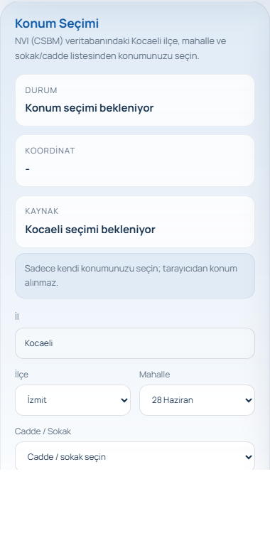
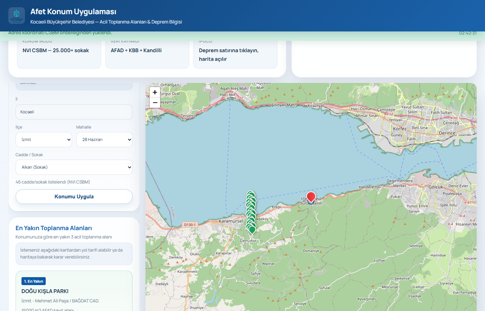
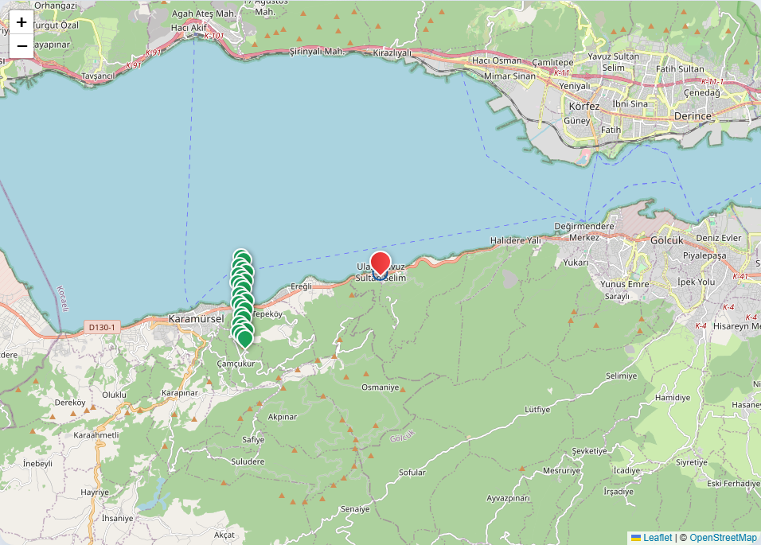
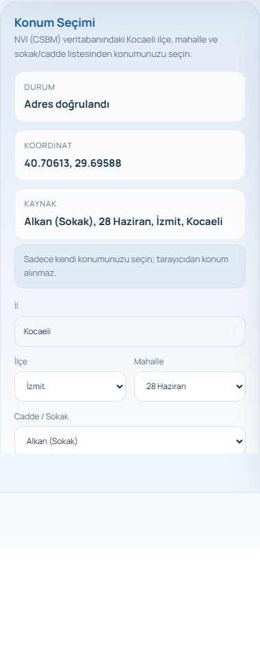
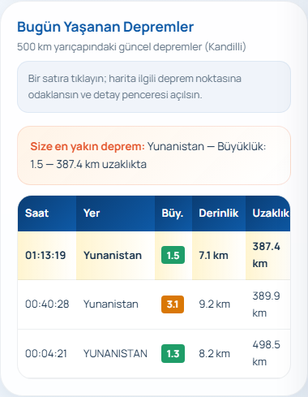
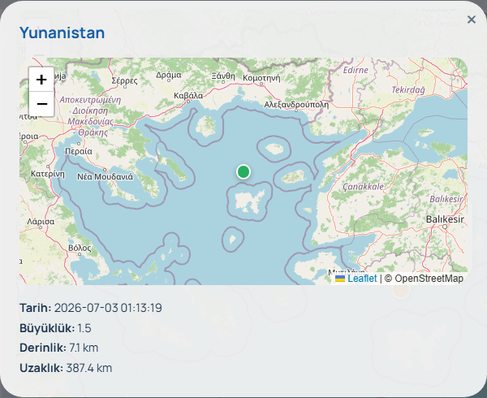
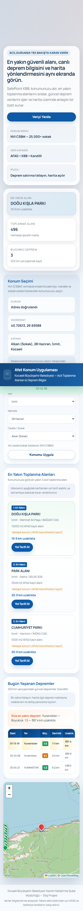

<div align="center">

# SafePoint KBB

**Kocaeli Disaster Location Application**

A web application that presents emergency assembly areas and current earthquake data in Kocaeli together on a map.

[](https://nodejs.org/)
[](https://expressjs.com/)
[](https://leafletjs.com/)
[](LICENSE)
[](#-tests)

[Features](#-features) ·
[Installation](#-installation) ·
[Execution](#-execution) ·
[Screenshots](#-screenshots) ·
[Folder Structure](#-folder-structure) ·
[Development Suggestions](#-development-suggestions)

</div>

---

## Project Name

**SafePoint KBB** — Kocaeli Metropolitan Municipality Disaster Location Application

## Project Description

SafePoint KBB is a professional practice (internship) project developed at the Kocaeli Metropolitan Municipality Software Development Branch Directorate. The application combines AFAD assembly area data, **NVI CSBM (Avenue/Street/Boulevard/Square) address hierarchy**, real street coordinates, and Kandilli earthquake records on a single screen.

The user selects one of the 12 districts of Kocaeli, their neighborhood, and an avenue/street option from the list. The system calculates the nearest emergency assembly areas, filters the earthquake data, and displays them on the map using the **real coordinate** of the selected address (OpenStreetMap + Nominatim).

## Purpose of the Project

| Target | Description |
|-------|----------|
| **Full address selection** | NVI CSBM-based 25,363 streets/avenues — not only AFAD areas |
| **Real coordinate** | Street-level location verification with OpenStreetMap + Nominatim |
| **Disaster awareness** | Making 496 emergency assembly areas in Kocaeli visible on the map |
| **Location-based routing** | Listing the nearest 3 areas based on the selected address |
| **Earthquake information** | Presenting Kandilli data by filtering it within a 500 km radius |
| **Ease of use** | Manual selection within Kocaeli without requiring browser location permission |
| **Secure architecture** | XSS protection, security headers, verified geocode proxy |

## Features

- **NVI CSBM location selection** — 12 districts, 488 neighborhoods, **25,363** avenues/streets/boulevards (İzmit: 3,428 streets)
- **Real street coordinates** — OSM/Nominatim cache + live geocode (`/api/street-location`)
- **Interactive map** — Kocaeli-focused view with Leaflet.js + OpenStreetMap
- **Distance calculation** — Geographical distance via the Haversine formula
- **Assembly areas** — List of the nearest 3 areas, map markers, and Google Maps directions
- **Earthquake data** — Live earthquake information via Kandilli API
- **Automatic refresh** — Earthquake data update every 60 seconds
- **Panel-map interaction** — Focusing on the map and detail modal upon clicking an earthquake row
- **Responsive design** — Mobile, tablet, and desktop compatible interface
- **Accessibility** — ARIA labels, keyboard navigation, live status messages
- **Security** — XSS protection with `escapeHtml()`, HTTP security headers, geocode rate limit

## Technologies Used

### Frontend

| Technology | Usage |
|-----------|----------|
| HTML5 | Semantic page structure |
| CSS3 | Modular styling architecture (BEM-like) |
| JavaScript (ES Modules) | Modular frontend architecture |
| Leaflet.js 1.9.4 | Map visualization |

### Backend

| Technology | Usage |
|-----------|----------|
| Node.js 18+ | Server runtime environment |
| Express.js 4.x | REST API and static file serving |
| CORS | Cross-origin request management |

### External Services

| Service | Usage |
|--------|----------|
| NVI CSBM (adres.nvi.gov.tr derivative) | Kocaeli district/neighborhood/street hierarchy |
| AFAD Kocaeli | Assembly area data |
| OpenStreetMap Overpass | Bulk street coordinate matching |
| Nominatim | Live address → coordinate resolution |
| Kandilli Earthquake API | Live earthquake data |
| Google Maps | Walking directions routing |

### Development Tools

| Tool | Usage |
|------|----------|
| Node.js Test Runner | Unit tests |
| Playwright | E2E tests and taking screenshots |

## Installation

### Requirements

- [Node.js](https://nodejs.org/) **18.0.0** or higher
- [npm](https://www.npmjs.com/) (Comes with Node.js)
- A modern web browser (Chrome, Firefox, Edge)

### Steps

```bash
# 1. Clone the repository
git clone [https://github.com/zeynepzehrakocaturk/SafePoint-KBB.git](https://github.com/zeynepzehrakocaturk/SafePoint-KBB.git)
cd SafePoint-KBB

# 2. Install dependencies
npm install

# 3. (For E2E tests) Install the Playwright browser
npx playwright install chromium

# 4. Run the tests
npm test
```

> **Note:** The `data/kocaeli-csbm-hierarchy.json` and `data/kocaeli-street-coordinates.json` files come ready in the repo; you can run it directly with `npm start`. If you want to regenerate the data:

```bash
npm run build:csbm
npm run geocode:streets -- --district=İzmit
```

## Execution

```bash
# Start the server
npm start
```

Open in browser: **http://localhost:3000**

### Usage steps

1. Select **District**, **Neighborhood** from the left panel, and **Avenue/Street** from the list
2. Click the **Apply Location** button
3. The system loads the real street coordinate and lists the nearest 3 assembly areas
4. Open the detail modal by clicking on the earthquake row
5. Get current data with **Refresh Data**

> **Note:** 25,363 streets/avenues across Kocaeli come from the NVI CSBM list. Streets whose coordinates are not in the cache are resolved live with Nominatim on the first selection and saved.

<details>
<summary><strong>Environment variables</strong></summary>

| Variable | Default | Description |
|----------|-----------|----------|
| `PORT` | `3000` | Server port number |
| `APP_URL` | `http://localhost:3000` | Screenshot/E2E test base URL |

```bash
# Example: Running on a different port
PORT=8080 npm start
```

</details>

## Screenshots

> Images were captured using the `npm run screenshots` command.

### Location Selection (NVI CSBM)

Full street list in the İzmit / 28 Haziran neighborhood example — compatible with PTT and NVI address systems.

<p align="center">
  
</p>

### Main Dashboard

The overall view of the application — assembly areas and earthquake list on the left panel, interactive map on the right.

<p align="center">
  
</p>

### Map View

The representation of user location, assembly area, and earthquake markers on the map.

<p align="center">
  
</p>

### Assembly Areas Panel

The nearest 3 emergency assembly areas based on location and Google Maps direction buttons.

<p align="center">
  
</p>

### Earthquake Panel

Listing of current earthquakes within a 500 km radius in a table format.

<p align="center">
  
</p>

### Earthquake Detail Modal

The detail window and mini-map that open when an earthquake in the table is clicked.

<p align="center">
  
</p>

### Mobile View

Responsive design test with a 390×844 viewport.

<p align="center">
  
</p>


## Folder Structure

```
SafePoint-KBB/
├── server.js                        # Application entry point
├── package.json                     # Project dependencies and scripts
├── LICENSE                          # MIT license
├── .gitignore
├── .editorconfig
│
├── src/server/                      # Backend source codes
│   ├── app.js                       # Express application factory
│   ├── config.js                    # Server configuration
│   ├── middleware/
│   │   └── security.js              # HTTP security headers
│   ├── routes/
│   │   └── api.routes.js            # REST API endpoints
│   └── services/
│       ├── csbmHierarchy.js         # NVI CSBM hierarchy + coordinate cache
│       └── nominatim.js             # Geocode proxy (cache + rate limit)
│
├── public/                          # Frontend static files
│   ├── index.html
│   ├── css/
│   │   ├── variables.css
│   │   ├── layout.css
│   │   ├── components.css
│   │   └── main.css
│   └── js/
│       ├── app.js                   # Application orchestration
│       ├── config/constants.js
│       ├── utils/                   # geo, dom, date, areaCoordinates
│       ├── services/                # api, earthquakeService
│       ├── ui/                      # assemblyPanel, earthquakePanel
│       └── map/mapController.js
│
├── data/
│   ├── acil-toplanma-alanlari.json  # 496 AFAD assembly areas
│   ├── kocaeli-csbm-hierarchy.json  # NVI CSBM: 25,363 streets
│   └── kocaeli-street-coordinates.json  # Street coordinate cache
│
├── docs/
│   ├── API.md
│   └── ARCHITECTURE.md
│
├── screenshots/
├── scripts/
│   ├── build-kocaeli-csbm-hierarchy.mjs
│   ├── geocode-kocaeli-streets.mjs
│   └── capture-screenshots.mjs
│
└── tests/
    ├── geo.test.mjs
    ├── areaCoordinates.test.mjs
    └── e2e-user-flow.mjs
```

## Tests

```bash
# Unit tests
npm test

# End-to-end user flow test (while server is running)
npm run test:e2e
```

Test coverage:

- Haversine distance calculation accuracy
- Coordinate verification and correction
- Approximate assembly area coordinate generation
- Manual location selection, listing nearby areas, earthquake modal, and data refreshing

## Documentation

| Document | Content |
|-------|--------|
| [API Documentation](docs/API.md) | REST endpoints and external APIs |
| [Architecture Documentation](docs/ARCHITECTURE.md) | System architecture and data flow |

## Known Limitations

| Issue | Description |
|------|----------|
| **Official warning** | The application is for informational purposes; follow AFAD and municipal channels for official disaster notifications. |
| **Assembly area coordinates** | The `geometry` field of many areas in the AFAD data is empty; approximate locations are used on the map. |
| **Street coordinate coverage** | A portion of the 25,363 streets is in the cache; the rest are resolved live with Nominatim on the first selection (1 sec/request). |
| **Geocode accuracy** | OSM/Nominatim data may be approximate at the street level; it does not include building numbers. |
| **Earthquake data** | Depends on the third-party Kandilli API; in case of an outage, the panel displays a warning. |


## License

This project is licensed under the [MIT License](LICENSE).

---

<div align="center">

*Professional Practice Project — 2025*

</div>
